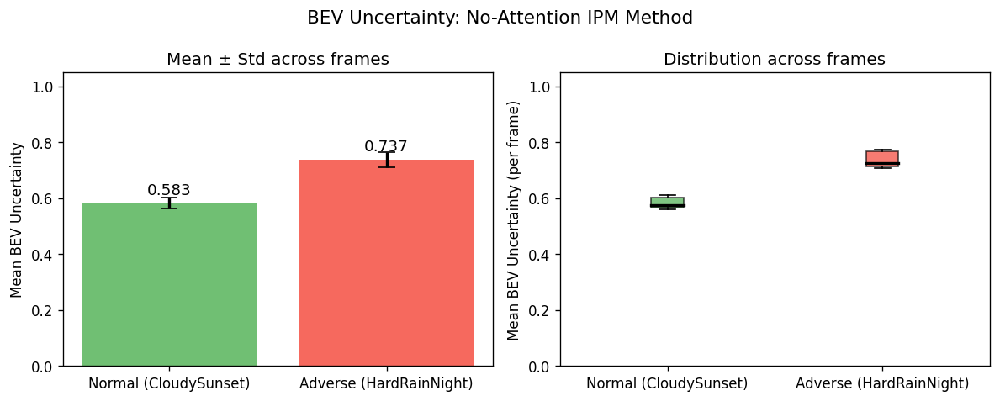
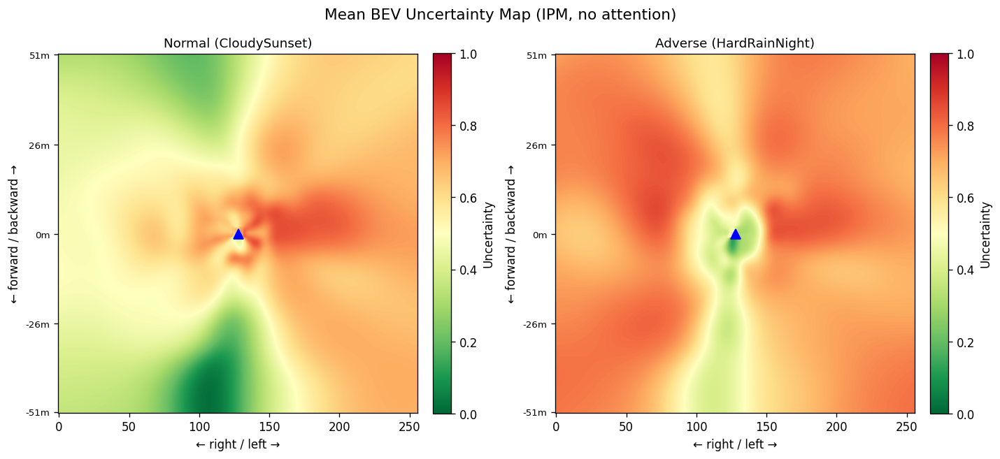
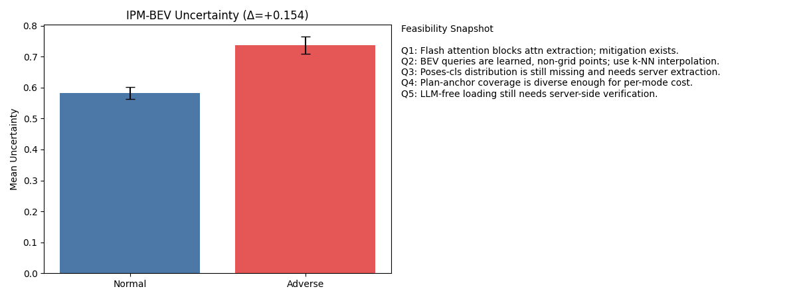

# 第五章 BEV 可视化与空间不确定性

本章说明：**全局 UQ / 全局 FiLM 不知道「哪一块路面更不可信」**；项目组已用 **IPM BEV 热力图** 与 **轨迹 GIF 中的 BEV 小窗** 两条线验证「空间化」方向。

---

## 5.1 为什么需要 BEV 可视化

| 问题 | 全局 FiLM / 全局 score |
|------|------------------------|
| 空间信息 | 6×1600 patch → 256 维向量，**丢失**「前方 vs 侧方」 |
| 调制方式 | 同一套 γ、β 作用于所有 BEV query |
| 现象 | 恶劣场景 Col↓ 的同时，Normal ADE **+116%**（第四章） |

**空间化目标**：让规划看见「哪条车道 / 哪个方向感知更差」，而不是整体调暗或整体保守。Phase 2 将把 BEV 不确定性接到 **轨迹 mode 代价**（第六章）；本章展示**已有可视化与定量苗头**。

---

## 5.2 IPM BEV 不确定性（不依赖 ORION 36GB 权重）

### 5.2.1 方法摘要

实现位于 `uq_estimator/bev_uncertainty.py`，评估脚本 `scripts/eval_bev_noattn.py`。

```text
6 相机 RGB
  → 按 ViT patch（16×16）计算 patch_quality（对比度等）
  → 相机标定 + 地面平面 IPM：像素中心投影到 BEV 网格（256×256，±51.2 m，0.4 m/px）
  → 不确定性 = 1 − quality；Gaussian splat 累积
  → log-scale 全局归一化到 [0, 1]
```

**与 Attention 路径对比**

| 维度 | IPM（当前主方案） | QT-Former attention 传播 |
|------|-------------------|---------------------------|
| 是否需要 ORION 推理 | **否**（仅需样例图像） | 是，且 Flash Attn 默认阻断 weights |
| 物理含义 | 地面哪些区域「看得清」 | 模型内部关注哪里 |
| 验证状态 | B2D **2 场景 × 10 帧** 已跑通 | 计划为消融 F 组 |

**关键实现结论**：必须使用 **log-scale** 全局归一化；线性归一化在重尾质量分布下会把 Adverse−Normal 的 Δ 从约 **+0.15** 压到约 **+0.01**（无效）。

### 5.2.2 定量结果（B2D 样例）

样例场景（`data/b2d_sample/`）：

| 条件 | 场景 | 帧数 | 覆盖区 BEV 不确定性均值 |
|------|------|------|-------------------------|
| Normal | CloudySunset（Weather **3**） | 10 | **0.5826**（σ≈0.020） |
| Adverse | HardRainNight（Weather **22**） | 10 | **0.7369**（σ≈0.028） |

**Δ = Adverse − Normal = +0.1543**（恶劣更高 → 指标有区分力）

原始 patch 质量：Normal 帧均值约 **68.97**，Adverse 约 **31.61**（约 **2.2×**）。两组 BEV 不确定性分布**基本无重叠**（见箱线/对比图）。

> 数值来源：`results/bev_noattn/report.txt`（2026-04-02 跑批）。

### 5.2.3 本节图表

**图 5-1** 两条件均值对比（建议汇报主图）



**图 5-2** 平均 BEV 热力图（Normal vs Adverse）



**图 5-3** 可行性仪表盘快照（含 IPM Δ 与 Phase −1 摘要）



**更高分辨率面板（可选附录幻灯片）**

| 文件（仓库内） | 内容 |
|----------------|------|
| `results/bev_noattn/panel_normal_w3.png` | 6 相机 + Normal BEV 热力 |
| `results/bev_noattn/panel_adverse_w13.png` | 6 相机 + Adverse BEV 热力 |
| `results/bev_noattn/score_boxplot.png` | 分布对比（若存在） |

**覆盖形态说明（口头即可）**：六相机扇区在 BEV 上呈**六边形**覆盖；车周近距离覆盖密，极远区域无观测→不确定性置 0。这与「全局一个 score」形成直观对比。

---

## 5.3 轨迹 GIF 中的 BEV（行为层可视化）

### 5.3.1 全画幅 GIF（相机 + BEV 小窗）

- **脚本**：`scripts/generate_trajectory_gifs.py`  
- **数量**：**18** 个场景，`results/gifs/*.gif`（约 250 MB）  
- **布局**：前置相机 + 轨迹箭头（绿 GT / 红 Baseline / 蓝 FiLM）+ 右下角 **BEV 俯视**（自适应范围）+ 场景名 / 天气 / UQ / L2 / 碰撞字幕  

**故事线分组（汇报选 2–3 个即可）**

| 线 | 目的 | 代表场景（示例） |
|----|------|------------------|
| S1 碰撞改善 | FiLM 降低 Col | ControlLoss_Weather14、ConstructionObstacle_Weather22 |
| S2 高 UQ 危险 | 极高 score 下行为 | Accident_Weather10、StaticCutIn_Weather18 |
| S3 晴 vs 恶劣 | UQ≈0 时 FiLM 近似透明 | ConstructionObstacle_Weather0、TJunction_Weather0 |
| S4 复杂交互 | 行人/让行/红灯 | PedestrianCrossing_Weather19、YieldToEmergencyVehicle_Weather10 |

### 5.3.2 纯 BEV GIF（轻量演示）

- **脚本**：`scripts/render_bev_gifs.py`（读 `results/gifs/trajectory_data.pt`，**无需 GPU**）  
- **产出**：`results/gifs/bev_only/*.gif`，**18** 个（约 20 MB）  

**注意**：缓存里早期 Baseline 曾受 `init_weights` 影响，图中标为 **Baseline\***（虚线）；数值结论以修复后的 `closedloop_baseline_50.json` 为准（第四章）。

### 5.3.3 两类 BEV 图的关系

| 类型 | 回答的问题 |
|------|------------|
| **§5.2 IPM 热力图** | 静态感知：路面**哪里**图像质量差 |
| **§5.3 轨迹 GIF** | 动态行为：GT / Baseline / FiLM **怎么走**，与 UQ 时间序列 |

二者互补：IPM 不依赖规划头；GIF 展示调制后的轨迹差异。

---

## 5.4 与 Phase 2 的衔接（预告）

| 已完成 | 待做 |
|--------|------|
| IPM 信号有效（Δ≈+0.15，2 场景） | 扩更多天气/场景 |
| `bev_uncertainty.py` 含 k-NN 轨迹代价、mode 调整接口 | 接入 forward，`λ` 训练 |
| Phase −1：BEV query 为 600 learned 点，**非** 30×30 网格 | 用 k-NN 插值，不用双线性 |
| Flash Attn 阻断 attention | **主链路不依赖** attention；Attention 仅作消融 |

**7 组消融中与 BEV 相关**

| 组 | BEV cost | 目的 |
|----|----------|------|
| D | 空间 | 无 FiLM，仅 BEV 代价 |
| F | 全局标量惩罚 | 对比 D，证明「空间」有独立价值 |
| E | 空间 + Score-Gate FiLM | 完整方案 |
| G | 全局 + FiLM | 对比 E |

详见第六章。

---

## 5.5 局限（本章可信度：中）

| 局限 | 说明 |
|------|------|
| 样本量 | IPM 定量仅 **2** 天气 × 10 帧，不能代表全 B2D |
| 未接入规划 | 热力图尚未改变 `poses_cls` / 轨迹输出 |
| 地面假设 | IPM 设 z=0，对高架/障碍物高度不敏感 |
| 深度扩展 | 仓库另有 `depth_panel_*.png` 实验性可视化，**未**纳入主结论 |

---

## 5.6 本章小结

- **IPM BEV** 在不跑 ORION 的情况下，已显示恶劣场景空间不确定性显著更高（**+0.154**）。  
- **轨迹 GIF** 提供 18 场景定性证据，便于组内讨论「保守 vs 激进」行为。  
- 空间化是 Phase 2 核心方向；全局 FiLM 的教训说明**仅有标量 UQ 不够**。

---

**下一章（按写作顺序）**：第三、四章 UQ 与 FiLM 定量结果；或先读第六章了解诊断与 Phase 2 全貌。
