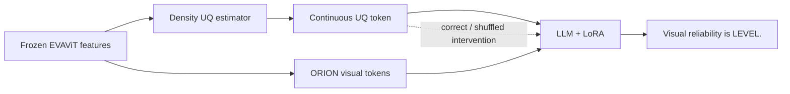
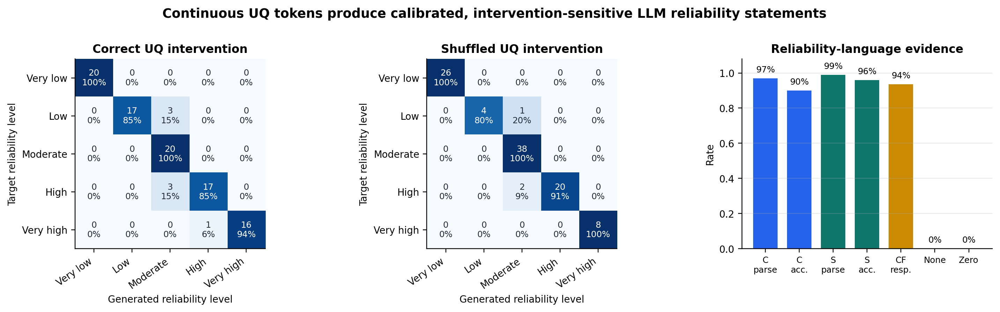

# Reliability QA R2d Results

## Claim

The continuous Density UQ token is read by the ORION language model and
verbalized as an explicit visual-reliability level. Changing only the injected
UQ token changes the generated reliability statement.

## Setup



```text
Training split: route-disjoint density-UQ training routes
Training frames: 300, balanced across five reliability levels
Frames per level: 60
Trainable parameters: UQ projector + LLM LoRA
Frozen: EVAViT, QT-Former, detector/map heads, base LLM, trajectory decoder
Calibration evaluation: 100 frames, 20 per reliability level
Language target: "Visual reliability is LEVEL."
```

Reliability levels are deterministic renderings of calibrated density
percentiles:

```text
very low / low / moderate / high / very high
```

## Main Results

| Intervention | Parse rate | Level accuracy | Ordinal MAE | Spearman |
| --- | ---: | ---: | ---: | ---: |
| Correct UQ | **0.97** | **0.90** | **0.072** | **0.981** |
| Shuffled UQ | **0.99** | **0.96** | **0.030** | **0.985** |

For the 78 samples whose correct and shuffled UQ values belonged to different
levels, the generated statement changed on 73:

```text
intervention response rate: 93.6%
```

Twenty-frame controls:

| Control | Parseable reliability statement |
| --- | ---: |
| No UQ token | 0/20 |
| Zero UQ token | 0/20 |

Without an effective UQ token, the model falls back to its original scene QA,
such as descriptions of traffic lights, vehicles, or lane-following behavior.



## Interpretation

These results support the limited claim:

> The language model reads the injected continuous UQ token and assigns it an
> explicit, calibrated visual-reliability meaning.

They do not yet establish improved planning or closed-loop safety. The next
stage should place the reliability statement after ORION's existing
critical-object QA and test whether that multi-round risk context affects the
waypoint representation while preserving clean-scene planning.

## Representative Counterfactual Cases

| Correct UQ | Correct output | Shuffled UQ | Shuffled output |
| ---: | --- | ---: | --- |
| 0.979 | `Visual reliability is very low.` | 0.143 | `Visual reliability is high.` |
| 0.603 | `Visual reliability is low.` | 0.334 | `Visual reliability is moderate.` |
| 0.397 | `Visual reliability is moderate.` | 0.153 | `Visual reliability is high.` |
| 0.125 | `Visual reliability is high.` | 0.265 | `Visual reliability is moderate.` |
| 0.035 | `Visual reliability is very high.` | 0.077 | `Visual reliability is very high.` |

The image is fixed within each row. Only the injected UQ token changes.
