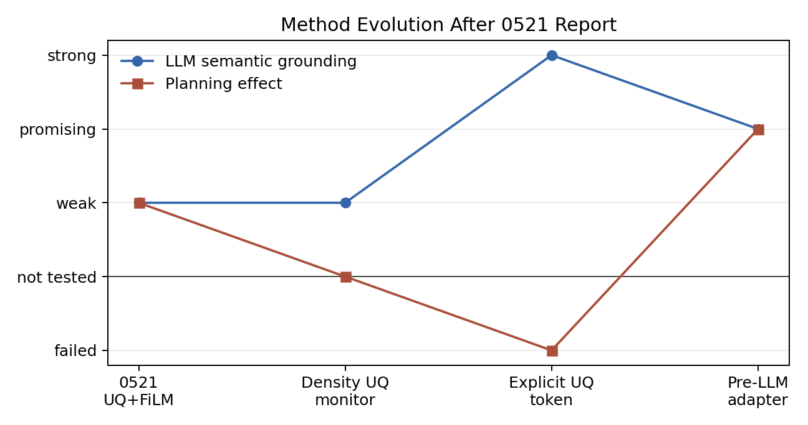
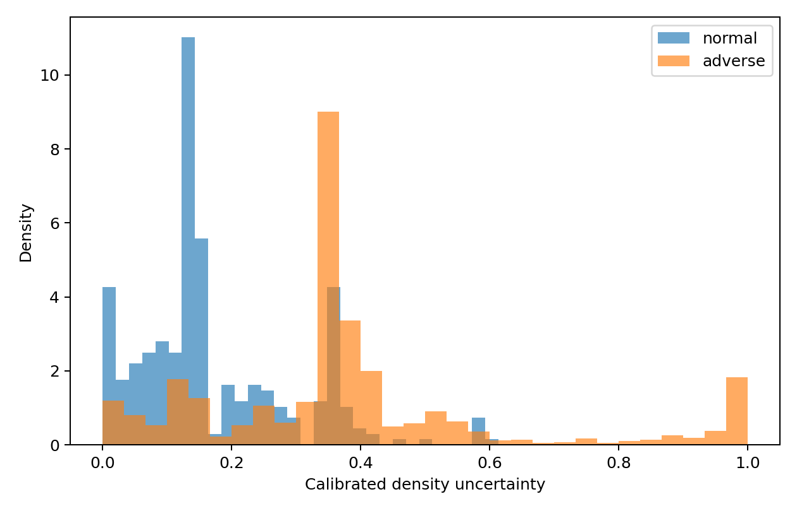
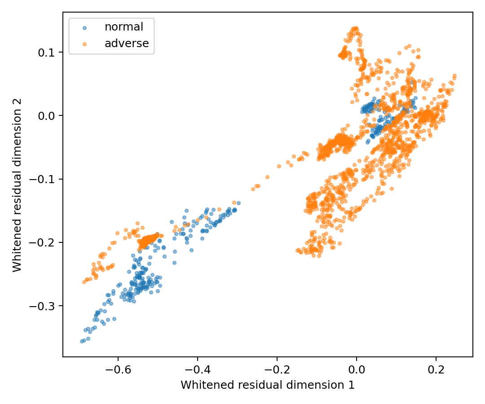
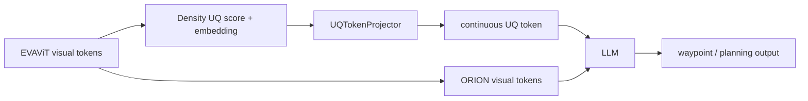
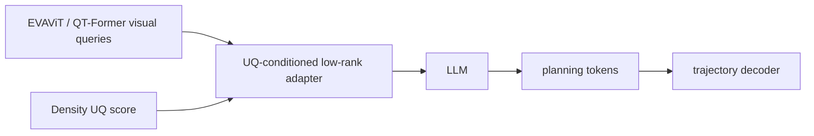
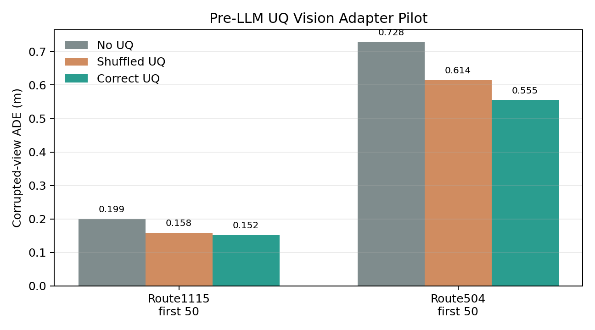
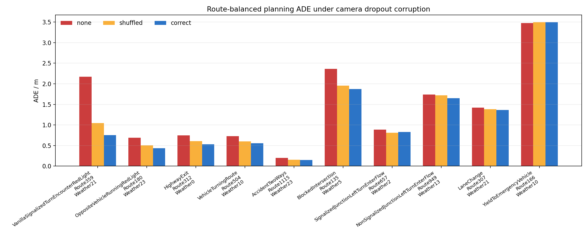
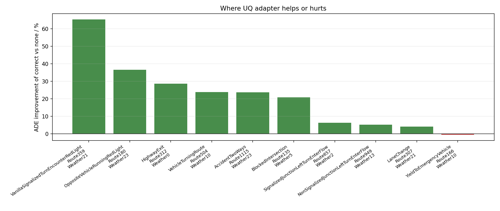
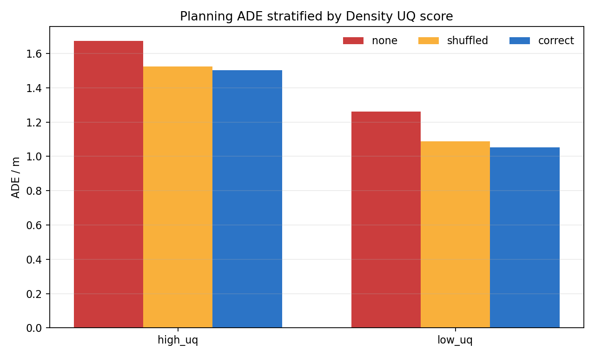
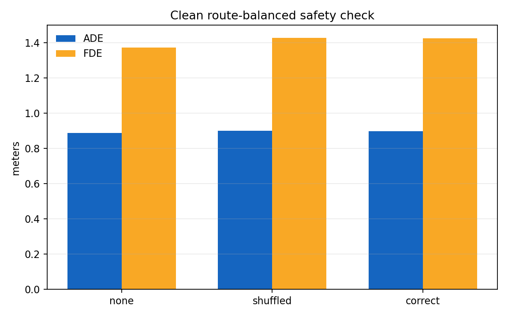

# UQ Token / Vision Adapter 阶段实验报告

> **历史阶段报告（已于 2026-08-29 被新主线替代）。** 本文保留 Density UQ、显式 token 和 pre-LLM vision adapter 的阶段性证据，不再代表当前执行方案。当前状态见 [../../docs/CURRENT_STATE.md](../../docs/CURRENT_STATE.md)，当前架构契约见 [../../docs/spatial_uq_two_stage_v2.md](../../docs/spatial_uq_two_stage_v2.md)。

> 日期：2026-06-22  
> 分支：`mid-report`  
> 目的：整理 0521 report 之后围绕“视觉骨干不确定性如何进入 ORION 规划链路”的设计、实验与下一步路线。

## 1. 结论摘要

0521 report 已经证明：原始 UQEstimator 能较好区分正常/恶劣视觉条件，但“用 UQ 分数直接做 FiLM/L2 调制”在研究叙事上容易被攻击，因为它绕过了大模型的决策形成过程，直接改后端规划表示。近期实验围绕这个问题做了三条路线：

| 路线 | 核心想法 | 当前结论 | 是否继续 |
|------|----------|----------|----------|
| Density UQ 监测 | 用 EVAViT token 分布密度估计不确定性 | 可作为更有文献依据的 UQ score/embedding 替代原人为 UQEstimator | 继续保留 |
| 显式 UQ token | 把 score/embedding 投影成 LLM 输入 token，让 LLM 自己读 | LLM 能读出可靠性语义，但规划改善失败 | 暂停扩大 |
| Pre-LLM vision adapter | 用 UQ score 轻量改视觉 token，再交给 LLM 决策 | 两个路线片段上 correct UQ 优于 shuffled/none，但还不稳 | 当前主线 |

一句话：**“让 LLM 自己用不确定性”这个方向是对的，但直接塞一个 UQ token 并不会自然改变规划；目前更可行的是在 LLM 前调整视觉证据，让 LLM 仍然承担规划决策。**



## 2. 与 0521 Report 的关系

0521 report 的主线是：

| 0521 阶段发现 | 当时方案 | 暴露问题 | 本阶段调整 |
|---------------|----------|----------|------------|
| 恶劣天气碰撞风险高，但 L2 不一定高 | 训练 UQEstimator 监测视觉退化 | UQ 标签含人为设定，理论说服力弱 | 换成基于正常特征密度的 Density UQ |
| UQ score 能区分 Normal/Adverse | Score-gated FiLM | 分数直接调制规划表示，像人为控制器 | 改为 LLM token / LLM 前视觉适配 |
| FiLM 可降低部分碰撞 | L1/L2 FiLM | L2 尤其容易被认为绕过大模型 | L2 降级为对比/备用，不再做主线 |
| BEV/IPM 显示空间不确定性存在 | 后续接 BEV cost | 仍需说明“不确定性如何影响决策” | 先验证 token/adapter 是否能改变 LLM 规划 |

因此，本阶段不是推翻 0521，而是把 0521 的 UQ 监测能力向更能站得住的机制推进：  
**从“我用分数调制规划器”转为“我把可靠性/受损视觉证据提供给 LLM，让 LLM 形成规划表示”。**

## 3. 当前设计

### 3.1 Density UQ：替代原人为 UQEstimator

旧 UQEstimator 输出：

```text
score:     用于打标签 / 门控
embedding: 用于调制 FiLM
```

当前 Density UQ 输出：

```text
score:     Mahalanobis / density distance 后的标量不确定性
embedding: PCA 密度方向，兼容 256 维输出接口
```

它的优点是：不再依赖人为构造“雨夜一定高、晴天一定低”的伪标签，而是从 EVAViT 正常样本的特征分布出发，衡量当前样本是否偏离正常视觉流形。这个解释比原来的手工 score 更容易被接受。





| 指标 | 结果 | 说明 |
|------|------|------|
| AUROC | 0.799 | 用于区分 held-out Normal/Adverse |
| AUPRC | 0.951 | Adverse 占比较高时更稳定 |
| Route bootstrap AUROC 95% CI | 0.675-0.915 | 受 50 条路线规模限制 |
| active embedding dim | 16 | 实际用于密度方向 |
| compatibility embedding dim | 256 | 保持旧接口兼容 |

### 3.2 显式 UQ token：语义可读，但规划不自然改变

显式 token 方案如下：



实验先验证一个关键问题：LLM 是否真的能读懂这个 continuous token。R2d reliability QA 的结果是肯定的。


| 设置 | parse / accuracy | 结论 |
|------|------------------|------|
| correct UQ | 0.97 / 0.90 | LLM 可以从 token 中读出可靠性 |
| shuffled UQ | 0.99 / 0.96 | token 改变后，语言输出也随之改变 |
| none / zero | 0 / 20 parseable | 没有 UQ 信息时不能凭空生成可靠性描述 |

但规划敏感性很弱：

| 指标 | correct text | shuffled text | 差异 |
|------|--------------|---------------|------|
| ADE | 0.2362 | 0.2367 | 几乎相同 |
| hidden L2 | - | - | 0.4301 |
| trajectory displacement | - | - | 0.00283 m |

解释：LLM 的语言通道能读取 UQ，但 ORION 的规划输出已经被训练成特定 waypoint token/trajectory decoder 路径；没有规划监督时，可靠性语义不会自然转化成轨迹变化。

### 3.3 Paired corruption：用“受损图像”制造监督

为了避免手工指定“高不确定性就刹车/减速”，我们设计了 paired corruption：

```text
clean image      -> expert trajectory
corrupted image  -> same scene geometry, same expert trajectory
```

训练目标不是让模型输出人为保守轨迹，而是让 correct UQ 帮助 corrupted view 恢复 clean view 的规划表示：

```text
distance(corrupted + correct UQ, clean reference)
  <
distance(corrupted + shuffled UQ, clean reference)
```

先审计哪些 corruption 会被 Density UQ 识别：

| Corruption | Severity | Mean UQ delta | Increase rate |
|------------|----------|---------------|---------------|
| camera dropout | 1 | +0.0895 | 1.00 |
| camera dropout | 2 | +0.6052 | 1.00 |
| camera dropout | 3 | +0.6369 | 1.00 |
| blur | 2 | +0.0017 | 0.50 |
| dark | 3 | -0.0167 | 0.00 |

因此当前采用 **one-camera dropout severity 1**。它的含义清晰：视觉输入确实受损，且 UQ score 会稳定升高。

### 3.4 Pre-LLM vision adapter：当前主线

显式 token 失败后，我们保留“LLM 决策”原则，但把注入位置前移：



适配器形式：

```text
adapted_query = query + uq_score * up(GELU(down(LN(query))))
```

关键约束：

| 约束 | 实现 |
|------|------|
| 初始不破坏 ORION | `up` 零初始化，初始严格 identity |
| 不绕过 LLM | adapter 作用在 LLM 输入视觉 query 上 |
| 不直接写轨迹 | 没有接触 VAE/trajectory decoder |
| 可做因果对照 | 比较 correct / shuffled / none UQ |

## 4. 实验结果

### 4.1 显式 UQ token 规划实验：负结果

50-frame consistency-only pilot：

| View | UQ mode | ADE | FDE |
|------|---------|-----|-----|
| corrupted | none | 0.1910 | 0.3059 |
| corrupted | shuffled | 0.2147 | 0.3889 |
| corrupted | correct | 0.2447 | 0.4359 |
| clean | none | 0.0808 | 0.0771 |
| clean | correct | 0.1031 | 0.1018 |

Counterfactual ranking pilot：

| UQ mode | ADE | FDE |
|---------|-----|-----|
| none | 0.1964 | 0.3120 |
| shuffled | 0.3054 | 0.5472 |
| correct | 0.3159 | 0.5698 |

结论：显式 token 能被读懂，但在当前小规模规划训练下，**correct UQ 没有优于 shuffled，甚至更差**。按 stop rule，不继续扩大这条路线。

### 4.2 Vision adapter：当前最有希望结果

100-step adapter-only pilot，LoRA learning rate = 0，仅训练 adapter。



Route1115 first 50：

| View | UQ mode | ADE | FDE |
|------|---------|-----|-----|
| corrupted | none | 0.1991 | 0.3145 |
| corrupted | shuffled | 0.1583 | 0.2490 |
| corrupted | correct | **0.1520** | **0.2398** |
| clean | none | 0.0821 | 0.0752 |
| clean | correct | **0.0789** | 0.0795 |

Route504 first 50：

| View | UQ mode | ADE | FDE |
|------|---------|-----|-----|
| corrupted | none | 0.7284 | 0.9167 |
| corrupted | shuffled | 0.6144 | 0.7593 |
| corrupted | correct | **0.5547** | **0.6749** |
| clean | none | 0.5039 | 0.5546 |
| clean | correct | **0.4650** | **0.5408** |

但 Route1115 first 100 的后半段失败：

| UQ mode | ADE | FDE |
|---------|-----|-----|
| none | **2.7355** | **5.6492** |
| shuffled | 2.7740 | 5.7373 |
| correct | 2.7726 | 5.7350 |

解释：adapter 不是偶然完全无效，因为它在两个路线片段上都表现出 correct > shuffled > none 的趋势；但它还没有泛化到更难的后半段。下一步必须做 route-balanced 训练/评估，而不是继续用顺序前 N 帧。

### 4.3 Route-balanced adapter eval：平均有效，但路线级仍不稳定

为了避免只看某条路线前 N 帧造成偶然性，后续使用 `pilot100.pt` 在 calibration split 上做 route-balanced evaluation：10 条路线，每条抽 50 个候选帧，其中 35 个有效 planning frame，共 350 个有效样本。输入采用 one-camera dropout severity 1，比较 `none / zero / shuffled / correct` 四种干预。

整体结果：

| UQ mode | ADE | FDE | Count |
|---------|-----|-----|------:|
| none | 1.4429 | 2.5210 | 350 |
| zero | 1.4429 | 2.5210 | 350 |
| shuffled | 1.2286 | 2.1969 | 350 |
| correct | **1.1641** | **2.0955** | 350 |

相对改善：

| 对比 | ADE 改善 |
|------|---------:|
| correct vs none | +19.3% |
| correct vs shuffled | +5.3% |



Per-route 结果显示，correct 相比 none 在 10 条路线中的 9 条改善；相比 shuffled 在 8 条路线中改善。主要收益来自 `VanillaSignalizedTurnEncounterRedLight`、`OppositeVehicleRunningRedLight`、`HighwayExit`、`VehicleTurningRoute` 和 `BlockedIntersection` 等路线。`YieldToEmergencyVehicle` 基本无改善，`SignalizedJunctionLeftTurnEnterFlow` 相比 shuffled 略差。



因此当前能较稳妥地说：**pre-LLM adapter 的平均效果成立，并且 correct UQ 优于 shuffled UQ；但路线级稳定性还不足，不能声称已经泛化。**

### 4.4 High/low UQ 分层：没有证明收益集中在高 UQ

为了检验“UQ 信息是否主要在高不确定性样本上起作用”，保存逐样本 planning 记录，并按 Density UQ score 的中位数划分 high-UQ / low-UQ 两组。

| UQ group | Count | none ADE | shuffled ADE | correct ADE | correct vs none | correct vs shuffled |
|----------|------:|---------:|-------------:|------------:|----------------:|--------------------:|
| high-UQ | 192 | 1.673 | 1.526 | **1.502** | +10.2% | +1.6% |
| low-UQ | 158 | 1.262 | 1.089 | **1.052** | +16.7% | +3.4% |



这个结果有两层含义：

1. correct UQ 在 high-UQ 和 low-UQ 两组都优于 none 和 shuffled，说明 adapter 的收益不是完全来自随机扰动；
2. 但收益并没有集中在 high-UQ，low-UQ 组的相对改善反而更大。

因此，当前阶段不能把结论写成“高 UQ 场景收益更明显”。更准确的表述是：**Density UQ 已经能作为有效条件信号改善平均 planning，但 score 标量与 planning 收益强度之间的单调关系尚未建立。** 后续需要进一步做 score 校准、按路线/场景类型分层，或把 active density embedding 也注入 adapter，而不是只用 score。

### 4.5 Clean safety check：ADE 基本安全，FDE 仍需约束

为了确认 adapter 不会破坏正常视觉输入，又在 clean view 上跑了同样的 route-balanced 逐样本评估。

| View | UQ mode | ADE | FDE | Count |
|------|---------|-----|-----|------:|
| clean | none | **0.8884** | **1.3707** | 350 |
| clean | shuffled | 0.9008 | 1.4265 | 350 |
| clean | correct | 0.8971 | 1.4248 | 350 |

相对 none：

| 指标 | correct 变化 |
|------|-------------:|
| ADE | -1.0% |
| FDE | -3.9% |



这里的负号表示退化。结论是：**clean ADE 基本安全，退化约 1.0%，低于 3% 阈值；但 clean FDE 退化约 3.9%，略高于原先设定的严格阈值。** 这说明下一轮训练需要更明确的 clean preservation loss 或 identity regularization，不能只看 corrupted-view ADE 改善。

### 4.6 展示用 GIF

为了展示 adapter 如何改变轨迹，已生成三条路线的 BEV trajectory GIF：

| Route | 用途 | 说明 |
|-------|------|------|
| `VehicleTurningRoute_Town15_Route504_Weather10` | 正向样例 | route-balanced 中 correct 明显优于 none/shuffled |
| `BlockedIntersection_Town03_Route135_Weather5` | 复杂路口样例 | route-level correct 优于 none/shuffled，但局部片段有波动 |
| `YieldToEmergencyVehicle_Town04_Route166_Weather10` | 失败/不稳定样例 | 用于主动说明方法边界 |

GIF 只用于展示“注入会改变规划行为”，不作为单独的 correct-UQ 最优证据。定量主结论仍以 route-balanced 表格为准。

## 5. 设计判断：为什么不直接回到 L2 调制

用户提出的担心是成立的：直接做 L2 调制，在项目叙事上像是在“绕过大模型”。

| 方法 | 是否绕过 LLM | 说服力 | 风险 |
|------|--------------|--------|------|
| L2 FiLM | 高 | 弱 | 像手工控制轨迹 decoder |
| L1 FiLM | 中 | 中 | 改视觉/查询，但语义不清 |
| 显式 UQ token | 低 | 强 | 需要训练证明 LLM 会用 |
| Pre-LLM adapter | 低-中 | 较强 | 改视觉证据而非轨迹，但语义弱于 token |
| Monitoring-only | 不涉及 | 稳 | 不能声称改善规划 |

因此当前排序是：

1. **主线：Pre-LLM vision adapter**  
   它不直接调轨迹，而是让 LLM 看到经过可靠性条件化的视觉证据。
2. **解释性结果：R2d reliability QA**  
   证明 LLM 可以读取 continuous UQ，不确定性信息不是无意义噪声。
3. **备用：Monitoring-only UQ**  
   如果 adapter 扩展失败，就把贡献收敛到可靠监测和风险分层，不强行声称规划提升。
4. **L2 FiLM 只作为对比**  
   可用于证明“直接改 decoder 容易出结果但不符合本文主张”。

## 6. 下一步最短实验路线

为了尽快支持中期报告，不建议再开大而全训练。建议按以下顺序推进：

| 阶段 | 目标 | 配置 | 预计耗时 | 通过标准 |
|------|------|------|----------|----------|
| P1 route-balanced eval | 验证 pilot 是否只是路线片段偶然性 | 不训练，只用 `pilot100.pt`，每条 calibration route 抽 30-50 帧 | 已完成 | correct 平均优于 shuffled |
| P2 route-balanced train | 修复顺序采样偏差 | 500-1000 paired samples，adapter-only，LoRA lr=0 | 2-4 小时 | route bootstrap 上 correct > shuffled |
| P3 clean safety check | 防止 adapter 破坏正常输入 | clean view none/correct 对比 | 已完成 | ADE 退化 < 3%，FDE 略超 3% |
| P4 report-ready ablation | 中期报告表格 | none / zero / shuffled / correct，分 high-UQ/low-UQ | 已完成 | correct 两组均优于 shuffled，但 high-UQ 更明显未成立 |

推荐优先做 P1 和 P2。它们能最快回答：

```text
UQ 注入到底有没有被模型使用？
correct UQ 是否比 shuffled UQ 更有用？
这种收益是否只出现在受损视觉输入上？
```

## 7. 当前可对外表述

较稳妥的表述：

> 我们首先用密度估计替代原先人为设定的 UQEstimator，使视觉骨干不确定性具有更明确的分布外检测解释。然后，我们尝试将该不确定性以显式 token 注入 LLM，发现 LLM 能够读取并语言化可靠性信息，但规划输出不会在缺少配对监督时自然改变。基于这一诊断，我们改用 identity-initialized pre-LLM vision adapter，让不确定性调节进入 LLM 前的视觉证据而非直接改 trajectory decoder。初步 paired-corruption 实验显示，在两个路线片段上 correct UQ 优于 shuffled/none，说明该机制有继续扩展的价值；但它尚未在所有路线段稳定成立，需要 route-balanced 训练和评估。

不应过度声称：

| 不应声称 | 原因 |
|----------|------|
| “UQ token 已经改善规划” | 显式 token planning pilot 是负结果 |
| “adapter 已经泛化” | Route1115 first 100 后半段失败 |
| “高 UQ 等于碰撞风险” | UQ 与 L2/碰撞相关性弱 |
| “我们已经解决不确定性规划” | 当前只是机制验证和小规模 pilot |

## 8. 代码与产物索引

| 类型 | 路径 |
|------|------|
| Density UQ | `uq_estimator/density.py` |
| UQ token projector | `uq_estimator/token_projector.py` |
| Vision adapter | `uq_estimator/vision_adapter.py` |
| Corruption | `uq_estimator/corruptions.py` |
| 主训练脚本 | `scripts/train_uq_token.py` |
| UQ audit | `scripts/audit_corruption_uq.py` |
| token 负结果 | `reports/uq_token/paired_planning_pilot.md` |
| adapter pilot | `reports/uq_token/vision_adapter_pilot.md` |
| 本报告图 | `reports/uq_token/assets/` |
